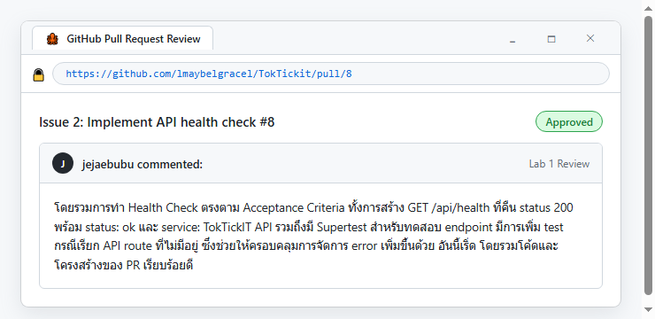
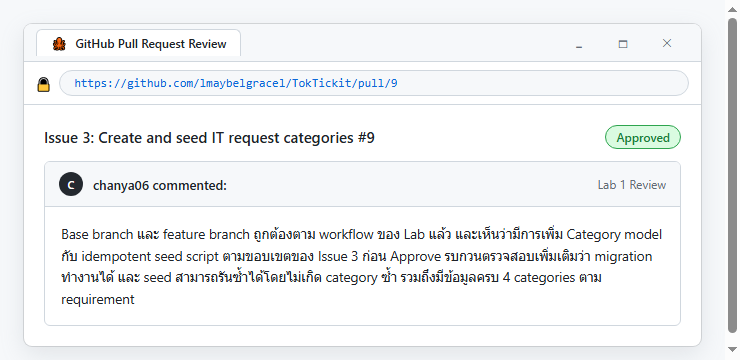
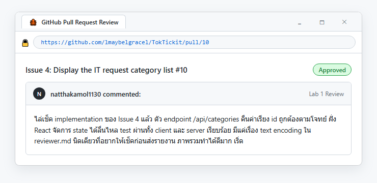
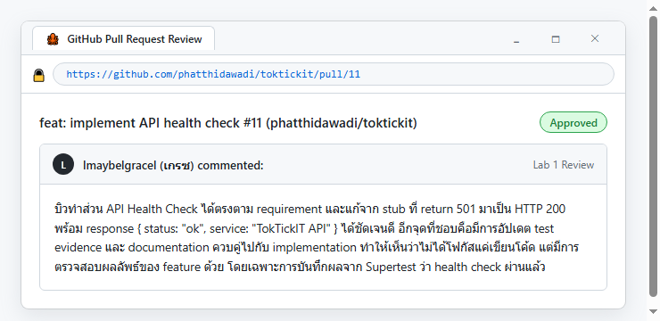
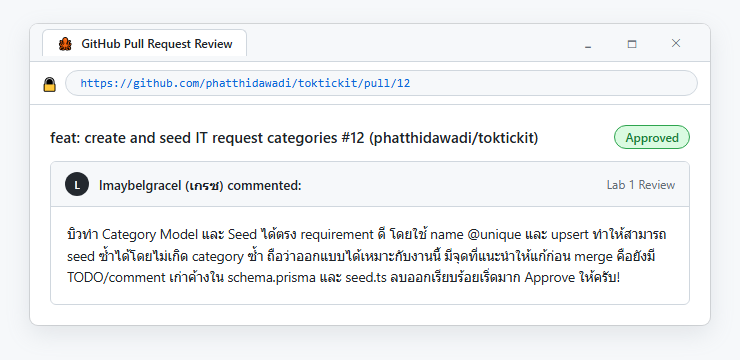
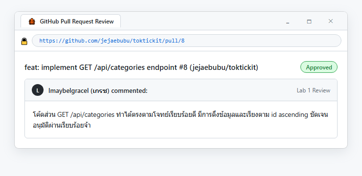
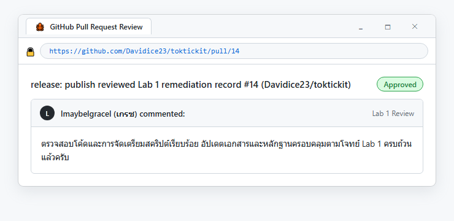

# Lab 1 — Peer Review Record

**Author:** เกรซ — GitHub: @lmaybelgracel  
**Peer reviewer:** บิว — GitHub: @phatthidawadi  

## Pull Requests I authored (reviewed by my partners)
| PR | Branch | Reviewer verdict |
|----|--------|------------------|
| [#6](https://github.com/lmaybelgracel/TokTickit/pull/6) | feature/1-project-foundation | Approved |
| [#8](https://github.com/lmaybelgracel/TokTickit/pull/8) | feature/2-health-check | Approved by @phatthidawadi & @jejaebubu |
| [#9](https://github.com/lmaybelgracel/TokTickit/pull/9) | feature/3-category-seed | Approved by @chanya06 & @phatthidawadi |
| [#10](https://github.com/lmaybelgracel/TokTickit/pull/10) | feature/4-category-list | Approved by @natthakamol1130 & @chanya06 |

### PR #8 (feature/2-health-check)
**Reviewer comment I received:** "ดูแล้วโดยรวมทำได้ตรงตาม Issue มีการเพิ่ม /api/health และเขียน test ด้วย supertest ครบทั้งกรณีที่ endpoint ทำงานปกติและกรณีเรียก route ที่ไม่มีอยู่ ส่วนที่อยากเสนอเพิ่มเติมคืออาจเพิ่ม test กรณี response body ไม่ตรงตามที่กำหนด หรือกรณีเกิด error ภายใน server อีกสักกรณี เพื่อให้การทดสอบ health check ครอบคลุมมากขึ้น"

**How I responded:** "ขอบคุณบิวมากๆ สำหรับคำแนะนำเพิ่มเติมครับ! ได้ทำการเพิ่ม Supertest test cases ทั้งการตรวจสอบ Schema ของ Response Body และการจำลองสถานะ Error ภายใน Server (HTTP 500) เพิ่มเติมใน server/tests/lab-01/health.test.ts รวมเป็น 4 test cases ครอบคลุมทุกสภาวะเรียบร้อยแล้วครับ"

---

### PR #9 (feature/3-category-seed)
**Reviewer comment I received:** "Base branch และ feature branch ถูกต้องตาม workflow ของ Lab แล้ว และเห็นว่ามีการเพิ่ม Category model กับ idempotent seed script ตามขอบเขตของ Issue 3 ก่อน Approve รบกวนตรวจสอบเพิ่มเติมว่า migration ทำงานได้ และ seed สามารถรันซ้ำได้โดยไม่เกิด category ซ้ำ รวมถึงมีข้อมูลครบ 4 categories ตาม requirement"

**How I responded:** "ขอบคุณบิวมากครับ! ได้ทำการสร้างและเพิ่มไฟล์ Migration (`server/prisma/migrations/20260812000000_init/migration.sql`) รวมถึงเพิ่มผลการทดสอบการรัน Seed สคริปต์ซ้ำซ้อน ยืนยันว่าสร้างหมวดหมู่ครบทั้ง 4 รายการ (Account and Access, Hardware, Software, Network) ถูกต้องโดยไม่มีการสร้างข้อมูลซ้ำเรียบร้อยครับ"

---

### PR #10 (feature/4-category-list)
**Reviewer comment I received:** "โดยรวมทำได้ตรงตาม Issue ทั้งการเพิ่ม API /api/categories และนำข้อมูลมาแสดงใน React UI รวมถึงมี test เพิ่มเข้ามาด้วย แนะนำเพิ่มเติมว่าอาจเพิ่ม test กรณี API คืนข้อมูลเป็น array ว่าง หรือเกิด error จาก API เพื่อเช็กว่า UIแสดงผลได้เหมาะสมในกรณีที่ไม่มี category หรือโหลดข้อมูลไม่สำเร็จ"

**How I responded:** "ขอบคุณสำหรับข้อเสนอแนะ ได้เพิ่มการแสดงผลกรณีหมวดหมู่เป็นอาร์เรย์ว่าง No categories available ใน React UI และเพิ่ม Vitest UI test cases สำหรับกรณีหมวดหมู่ว่างและกรณี API โหลดข้อมูลไม่สำเร็จใน client/tests/lab-01/App.test.tsx รวมเป็น 4 test cases เรียบร้อยแล้ว"

---

## Pull Requests I reviewed for my partners

| PR | Author / Branch | Reviewer verdict |
|----|-----------------|------------------|
| [#11](https://github.com/phatthidawadi/toktickit/pull/11) | @phatthidawadi (feat/api-health-check) | Approved |
| [#12](https://github.com/phatthidawadi/toktickit/pull/12) | @phatthidawadi (feat/category-model-seed) | Approved |
| [#8](https://github.com/jejaebubu/toktickit/pull/8) | @jejaebubu (feat/categories-endpoint) | Approved |
| [#14](https://github.com/Davidice23/toktickit/pull/14) | @Davidice23 (release/lab1-submission) | Approved |

### PR #11 (phatthidawadi/toktickit - feat: implement API health check)
**My review comment to partner:** "บิวทำส่วน API Health Check ได้ตรงตาม requirement และแก้จาก stub ที่ return 501 มาเป็น HTTP 200 พร้อม response { status: 'ok', service: 'TokTickIT API' } ได้ชัดเจนดี อีกจุดที่ชอบคือมีการอัปเดต test evidence และ documentation ควบคู่ไปกับ implementation ทำให้เห็นว่าไม่ได้โฟกัสแค่เขียนโค้ด แต่มีการตรวจสอบผลลัพธ์ของ feature ด้วย โดยเฉพาะการบันทึกผลจาก Supertest ว่า health check ผ่านแล้ว"

---

### PR #12 (phatthidawadi/toktickit - feat: create and seed IT request categories)
**My review comment to partner:** "บิวทำ Category Model และ Seed ได้ตรง requirement ดี โดยใช้ name @unique และ upsert ทำให้สามารถ seed ซ้ำได้โดยไม่เกิด category ซ้ำ ถือว่าออกแบบได้เหมาะกับงานนี้ มีจุดที่แนะนำให้แก้ก่อน merge คือยังมี TODO/comment เก่าค้างใน schema.prisma และ seed.ts ลบออกเรียบร้อยเริ่ดมาก Approve ให้ครับ!"

---

### PR #8 (jejaebubu/toktickit - feat: implement GET /api/categories endpoint)
**My review comment to partner:** "โค้ดส่วน GET /api/categories ทำได้ตรงตามโจทย์เรียบร้อยดี มีการดึงข้อมูลและเรียงตาม id ascending ชัดเจน อนุมัติผ่านเรียบร้อยจ้า"

---

### PR #14 (Davidice23/toktickit - release: publish reviewed Lab 1 remediation record)
**My review comment to partner:** "ตรวจสอบโค้ดและการจัดเตรียมสคริปต์เรียบร้อย อัปเดตเอกสารและหลักฐานครอบคลุมตามโจทย์ Lab 1 ครบถ้วนแล้วครับ"

